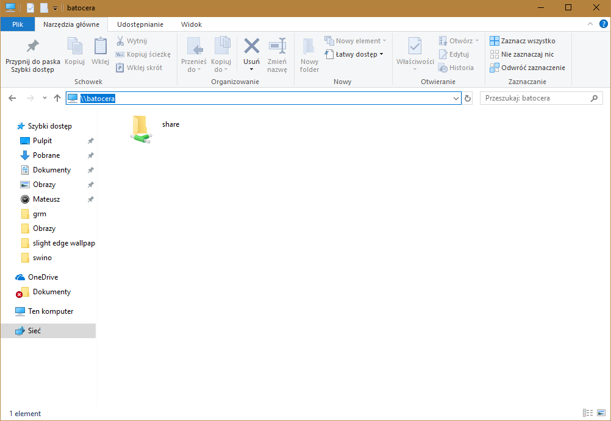
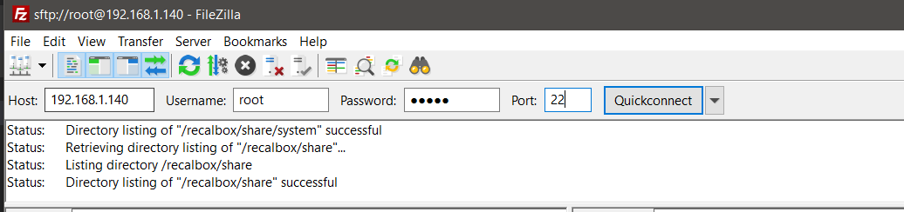
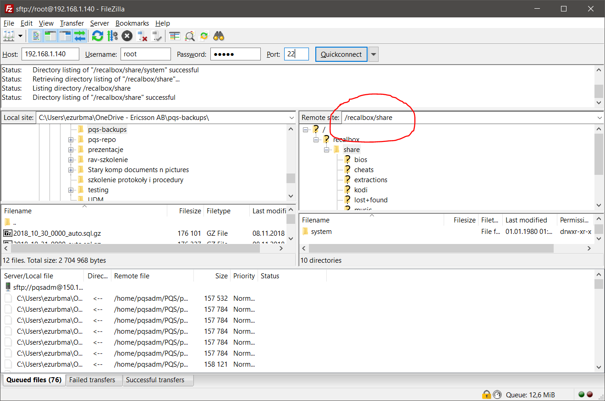

# RetroPi

## Konfiguracja kontrolera

Skonfiguruj przyciski na kontrolerze:
* uruchom menu opcji (przycisk `start`)
* wejdź do podmenu `Controllers settings > Configure a controller`
* system będzie prosił o naciśnięcie kolejno przycisków na padzie; podążaj za instrukcjami

Po tych krokach kontroler powinien być gotowy do gry.

Możesz używać kontrolerka z zestawu albo pada z PlayStation.

## Zgrywanie nowych gier

Żeby wgrać grę na Raspberry trzeba wgrać plik ROM do odpowiedniego katalogu. Przy poprawnym działaniu ROMy powinny być rozpoznawane automatyczne i pojawiać się w menu głównym.

### Skąd brać gry?

Po wpisaniu w google `<nazwa gry> ROM` powino się dać coś znaleźć. Lista obsługiwanych formatów jest dostępna tutaj: https://github.com/RetroPie/RetroPie-Setup/wiki/Supported-Systems. Jest to lista dla bardzo podobnego systemu (aczkolwiek nie identycznego), ale lista powinna się z grubsza pokrywać.

Dla przykładu: chcemy pobrać ROM *Legend of Zelda: Ocarina of Time*. Po chwili googlowania trafiamy na [tą stronę](https://emulator.games/roms/nintendo-64/legend-of-zelda-the-ocarina-of-time-v1-2/). Po pobraniu i rozpakowaniu okazuje się że plik ma rozszerzenie `.n64` a w tabelce widzimy że to jest obsługiwany format - wszytko OK.

Teraz ROMa wystarczy przenieść na konsolkę.

### Połączenie z wifi

Na sam początek trzeba podłączyć Raspberry do WiFi. Po tym jak uruchomi się konsolka:

* otwórz menu przyciskiem `start`
* wejdź do `network settings`
* przestaw `Enable WIFI` na ON
* ustaw odpowiednio **WIFI SSID** i **WIFI key**. WIFI SSID to po prostu nazwa pod jaką jest widoczna wasza sieć, czyli możesz sobie podejrzeć na Androidzie jak się nazywa wasze WiFi i przepisać do tego pola (niestety ten system chyba nie ma opcji wyszukiwania dostępnych sieci). WIFI key to hasło.
* zrestartuj konsolkę
* kiedy wszystko wstanie wróć do tego samego menu `network settings` i sprawdź czy jesteś połączony i czy został przydzielony adres IP. Jeżeli tak wszystko jest w porządku i można iść dalej.

### Przesłanie plików z komputera na konsolkę

#### Najprostszy najszybszy krok

* otwórz **Eksplorator Windows**.
* w pasku adresu wpisz ``\\batocera``

W tym momencie powinien się otworzyć folder, na którym znajdują się pliki z karty SD włożonej do Raspberry. Główny katalog nazywa się `Share`

#### Jeżeli poprzedni krok nie wyjdzie

Do przesyłania plików potrzebny jest program pozwalający na połączenie [ssh](https://pomoc.nazwa.pl/baza-wiedzy/produkty-i-uslugi/serwery/korzystanie-z-serwera/co-to-jest-ssh-ido-czego-sluzy/)/[sftp](https://pomoc.nazwa.pl/baza-wiedzy/produkty-i-uslugi/serwery/korzystanie-z-serwera/co-to-jest-sftp/).

Przykładowy program: [FileZilla](https://filezilla-project.org/download.php?platform=win64). To on będzie wykorzystywany w dalszej części instrukcji.

Pierwsze co to trzeba odczytać adres IP konsolki. W głównym menu (po naciśnięciu przycisku `start`) przejdź do `Network settings` i zapisz numer IP z pola `IP address`. 

W FileZilli wprowadź następujące dane:
* Host: `<ip odczytane z konsolki>`
* Username: `root`
* Password: `linux`
* Port: 22

I klik `Quickconnect`.

Główny katalog z plikami znajduje się pod ścieżką `/recalbox/share`

Pliki z romami wrzuca się do `/recalbox/share/roms/<katalog konsoli>`

# Kodi

[Kodi](https://kodi.tv/) to system do odtwarzania multimediów.

todo: instrukcje jak zmienić hasło